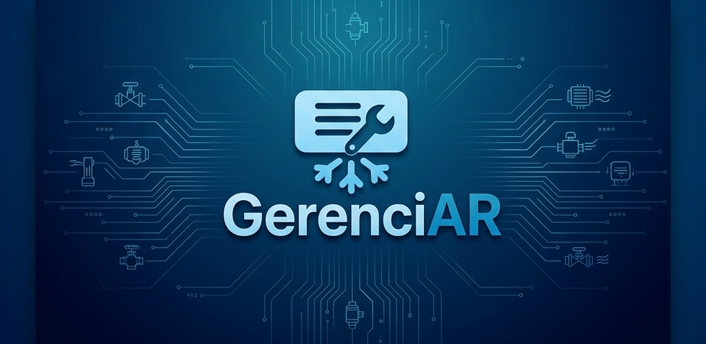

<p align="center">
  
</p>

<p align="center">
  Aplicativo mobile completo, construído em Flutter, para otimizar a rotina de técnicos e prestadores de serviço — gestão de clientes, agendamentos e ordens de serviço, funcionando <strong>com ou sem conexão à internet</strong>.
</p>

<p align="center">
  <a href="https://play.google.com/store/apps/details?id=gerenciar.tfc.gerenciar"><strong>📲 Baixar na Google Play Store</strong></a>
</p>

<p align="center">
  <code>Flutter</code> · <code>Dart</code> · <code>Firebase</code> · <code>SQLite</code> · <strong>Publicado na Play Store</strong>
</p>

---

## Minha contribuição

> Este é o meu fork do projeto, desenvolvido em dupla como Trabalho de Fim de Curso.
> Fui responsável por duas frentes:

### Arquitetura offline-first e sincronização

O desafio central do produto: técnicos de refrigeração trabalham em campo, frequentemente em locais sem sinal — casas de máquinas, subsolos, zona rural. Um app que exige conexão é inútil nesse contexto.

A solução implementada:

- **Persistência local em SQLite** como fonte primária de dados, não como cache
- **Fila de operações pendentes**, registrando cadastros, edições e conclusões feitas offline
- **Detecção de reconexão** e sincronização automática com o Firebase, sem ação do usuário
- **Repositório adaptativo**, que alterna entre fonte local e remota de forma transparente para as camadas superiores

O resultado é que o técnico usa o app normalmente sem internet e os dados sobem sozinhos quando o sinal volta — sem tela de erro, sem perda de trabalho, sem sincronização manual.

### Módulo de Ordens de Serviço

Fluxo completo de OS, da abertura à conclusão:

- Criação vinculada a cliente, técnico e agendamento
- Atualização de status ao longo do atendimento
- Conclusão com registro de serviço executado e valores
- **Exportação em PDF** para envio ao cliente
- Regras de permissão: apenas gestores reabrem OS concluídas

---

## O Problema

Muitos técnicos e prestadores de serviço, especialmente na área de refrigeração e climatização, ainda dependem de agendas de papel, planilhas e aplicativos de mensagens para gerenciar suas operações. A abordagem é ineficiente, sujeita a erros e perda de informação, e não dá visão nenhuma do negócio.

Sistemas existentes no mercado costumam ser complexos, caros, ou apresentam falhas críticas de sincronização em ambientes com conectividade instável — exatamente o cenário de quem trabalha em campo.

## A Solução

O **GerenciAR** centraliza as operações essenciais do dia a dia num único lugar, garantindo controle total das atividades mesmo offline: cadastro de clientes, agendamento inteligente de visitas, abertura e gestão de Ordens de Serviço, e sincronização automática assim que a conexão retorna.

---

## Funcionalidades

**Gestão completa**
- Clientes: cadastro completo e rápido
- Técnicos: gestores cadastram e gerenciam suas equipes
- Ordens de Serviço: criação, atualização e conclusão detalhadas

**Agendamento inteligente**
- Impede agendamentos simultâneos para o mesmo técnico, evitando conflito de agenda

**Operação 100% offline**
- Todas as funcionalidades essenciais funcionam sem internet
- Dados salvos localmente em SQLite e sincronizados com o Firebase ao reconectar

**Perfis de usuário**
- **Gestor:** acesso administrativo total — gerenciar técnicos, relatórios, reabrir OS, inativar cadastros
- **Técnico:** focado na execução — cadastrar clientes, agendar e concluir atendimentos

**Relatórios e exportação**
- Relatórios de atendimento e financeiros com filtros personalizáveis
- Exportação de OS concluídas em PDF

**Recursos adicionais**
- Notificações dos agendamentos do dia
- Seção de tutoriais integrada
- Interface com tema escuro

---

## Tecnologias

Arquitetura em camadas de `Domínio`, `Dados` e `Apresentação`.

| Categoria | Tecnologia |
|---|---|
| **Mobile** | Flutter · Dart |
| **Backend** | Node.js (Cloud Functions) |
| **Banco de dados** | Firebase (nuvem) · SQLite (local/offline) |
| **Arquitetura** | Clean Architecture adaptada, com repositório adaptativo alternando entre fontes online e offline |
| **Notificações** | OneSignal |

---

## Telas

| Login | Home | Cadastro de Técnico |
| :---: | :---: | :---: |
|  |  |  |

| Agendamento | Ordem de Serviço | Relatórios |
| :---: | :---: | :---: |
|  |  |  |

---

## Como executar

**Pré-requisitos**
- [Flutter](https://flutter.dev/docs/get-started/install) 3.x ou superior
- Emulador Android/iOS ou dispositivo físico

**Passos**

1. Clone o repositório:
   ```bash
   git clone https://github.com/Sam280903/gerenciar.git
   cd gerenciar
   ```

2. Instale as dependências:
   ```bash
   flutter pub get
   ```

3. Configure o Firebase:
   - Crie um projeto no [console do Firebase](https://console.firebase.google.com/)
   - Adicione o Flutter ao projeto e coloque o `google-services.json` em `android/app/`

4. Execute:
   ```bash
   flutter run
   ```

---

## Autores

Trabalho de Fim de Curso desenvolvido por:

- **Samuel Augusto Guimarães Lopes** — [@Sam280903](https://github.com/Sam280903) · *arquitetura offline-first e módulo de Ordens de Serviço*
- **Flávio Amorim Chagas** — [@flavioacmf](https://github.com/flavioacmf)

Sob orientação da Prof.ª Ma. Clarissa Avelino Xavier de Camargo, curso de Engenharia de Software da Universidade de Rio Verde (UniRV).

Repositório original: [flavioacmf/tfc](https://github.com/flavioacmf/tfc)
