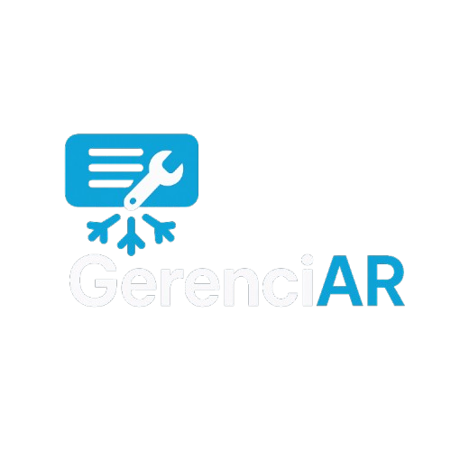
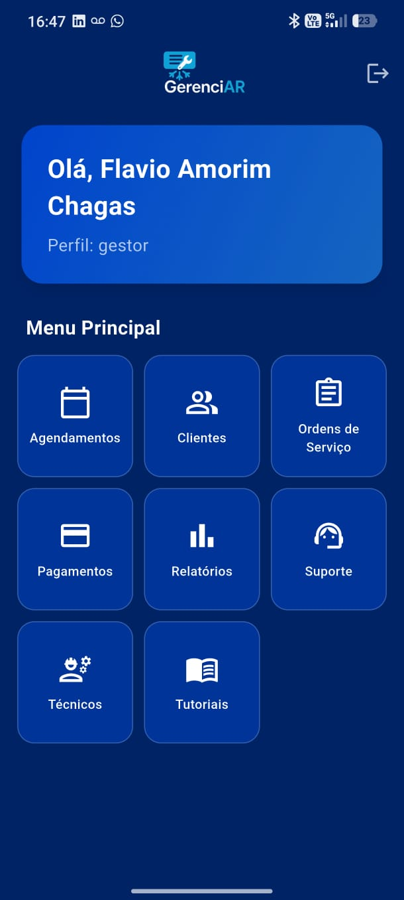
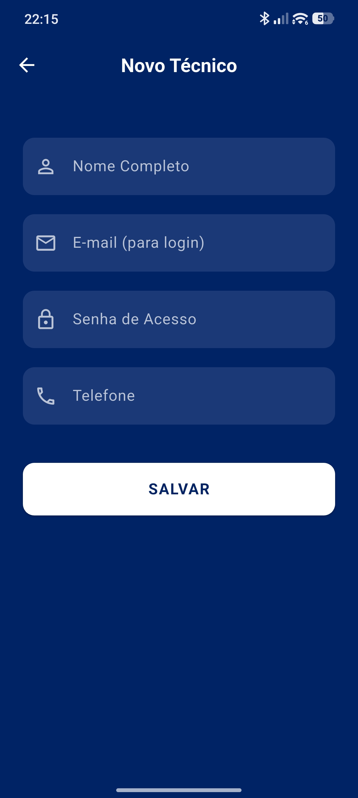
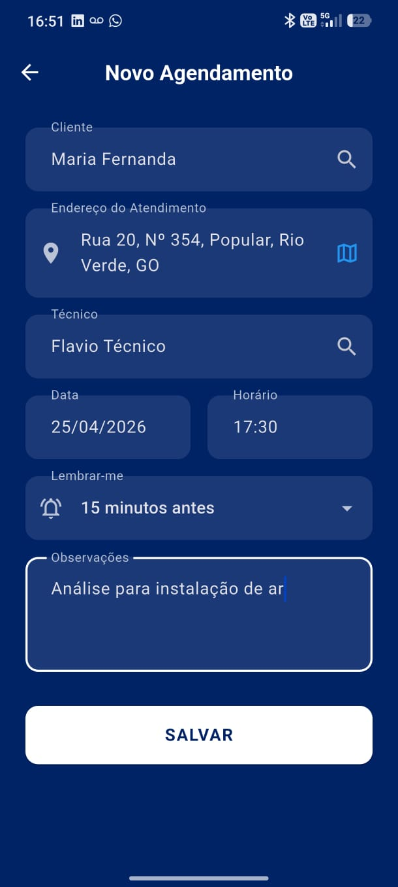
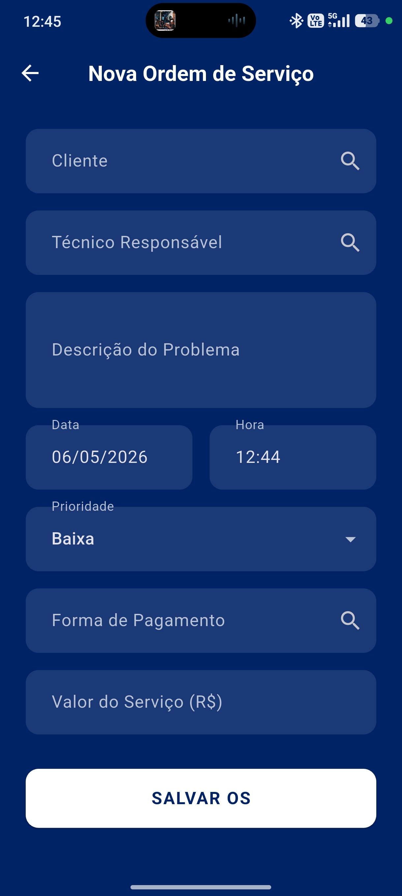
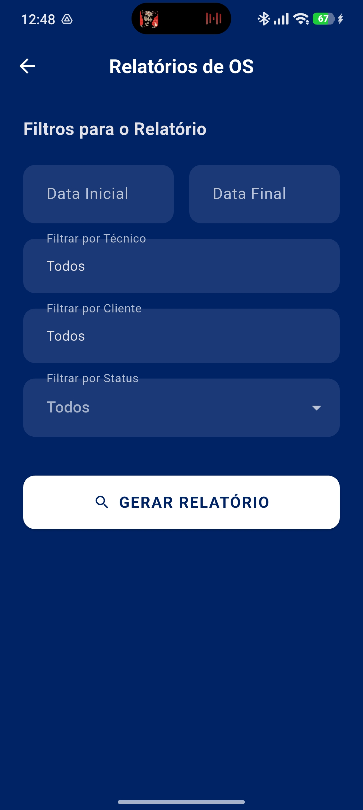

# GerenciAR - Gestão de Atendimentos Técnicos


<br>

<p align="center">
  
</p>

<p align="center">
  Um aplicativo mobile completo, construído em Flutter, para otimizar a rotina de técnicos e prestadores de serviço, com foco em gestão de clientes, agendamentos e ordens de serviço, funcionando de forma eficiente **com ou sem conexão à internet**.
</p>

---

### 🎯 O Problema

[cite_start]Muitos técnicos e prestadores de serviço, especialmente na área de refrigeração e climatização, ainda dependem de métodos manuais como agendas de papel, planilhas e aplicativos de mensagens para gerenciar suas operações[cite: 100, 212]. [cite_start]Essa abordagem é ineficiente, suscetível a erros, perda de informações e não oferece uma visão clara do negócio[cite: 101, 216].

[cite_start]Além disso, sistemas existentes no mercado muitas vezes são complexos, caros ou apresentam falhas críticas de sincronização de dados em ambientes com conectividade instável, um cenário comum para quem trabalha em campo[cite: 102, 103, 219].

### ✨ A Solução: GerenciAR

O **GerenciAR** foi projetado para ser a solução definitiva para esses profissionais. Um sistema intuitivo, robusto e confiável que centraliza todas as operações essenciais do dia a dia em um único lugar, garantindo que o técnico tenha total controle de suas atividades, mesmo offline.

[cite_start]O aplicativo permite o cadastro de clientes, agendamento inteligente de visitas, abertura e gestão de Ordens de Serviço (OS), e a sincronização automática de todos os dados assim que uma conexão com a internet é restabelecida[cite: 36, 105, 144].

---

### 🚀 Funcionalidades Principais

* **Gestão Completa:**
    * [cite_start]**Clientes:** Cadastro completo e rápido de clientes[cite: 343, 346].
    * [cite_start]**Técnicos:** Gestores podem cadastrar e gerenciar suas equipes[cite: 285, 288].
    * [cite_start]**Ordens de Serviço (OS):** Criação, atualização e conclusão de OS detalhadas[cite: 379, 382].
* **Agendamento Inteligente:**
    * [cite_start]Sistema que impede agendamentos simultâneos para o mesmo técnico, evitando conflitos de agenda[cite: 145, 255, 269].
* **Operação 100% Offline:**
    * [cite_start]Todas as funcionalidades essenciais (cadastros, agendamentos, OS) funcionam perfeitamente sem internet[cite: 35, 142].
    * [cite_start]Os dados são salvos localmente em um banco de dados **SQLite** e sincronizados automaticamente com o **Firebase** quando a conexão é restabelecida[cite: 694, 695, 702, 703].
* **Perfis de Usuário:**
    * [cite_start]**Gestor:** Acesso administrativo total para gerenciar técnicos, relatórios, reabrir OS e inativar cadastros[cite: 168, 172, 173].
    * [cite_start]**Técnico:** Focado na execução, com permissões para cadastrar clientes, agendar e concluir atendimentos[cite: 170, 171].
* **Relatórios e Exportação:**
    * [cite_start]Geração de relatórios de atendimentos e financeiros com filtros personalizáveis[cite: 175, 491, 494].
    * [cite_start]Exporte Ordens de Serviço concluídas para PDF[cite: 641, 644].
* **Recursos Adicionais:**
    * [cite_start]**Notificações:** Técnicos são notificados sobre seus agendamentos do dia[cite: 179, 550, 553].
    * [cite_start]**Tutoriais:** Seção de ajuda integrada para facilitar o uso da ferramenta[cite: 176, 521, 524].
    * **Temas:** Interface moderna e profissional com tema escuro.

---

### 🛠️ Tecnologias Utilizadas

Este projeto foi construído utilizando uma arquitetura moderna e escalável, separando as responsabilidades em camadas de `Domínio`, `Dados` e `Apresentação`.

| Categoria   | Tecnologia                                                                                                                                                            |
| ----------- | --------------------------------------------------------------------------------------------------------------------------------------------------------------------- |
| **Mobile** |                                                |
| **Backend** | [cite_start] (Conforme documento do TFC [cite: 114])                                         |
| **Banco de Dados** |  (Nuvem) <br>  (Local/Offline) |
| **Arquitetura** | **Clean Architecture** (Adaptada) com Repositório Adaptativo para alternar entre fontes de dados online e offline. |

---

### 🖼️ Telas do Aplicativo

| Login | Home | Cadastro de Técnico |
| :---: | :---: | :---: |
|  |  |  |

| Agendamento | Ordem de Serviço | Relatórios |
| :---: | :---: | :---: |
|  |  |  |

---

### 🏁 Como Executar o Projeto

Siga os passos abaixo para executar o projeto em sua máquina local.

**Pré-requisitos:**
* [Flutter](https://flutter.dev/docs/get-started/install) (Versão 3.x.x ou superior)
* Um emulador Android/iOS ou um dispositivo físico

**Passos:**

1.  **Clone o repositório:**
    ```bash
    git clone [https://github.com/flavioacmf/tfc.git](https://github.com/flavioacmf/tfc.git)
    cd tfc
    ```

2.  **Instale as dependências:**
    ```bash
    flutter pub get
    ```

3.  **Configuração do Firebase:**
    * Este projeto utiliza o Firebase. Você precisará criar um projeto no [console do Firebase](https://console.firebase.google.com/).
    * Siga as instruções para adicionar o Flutter ao seu projeto Firebase e adicione o arquivo `google-services.json` (para Android) na pasta `android/app/`.

4.  **Execute o aplicativo:**
    ```bash
    flutter run
    ```

---

### Autores

Este projeto é o Trabalho de Fim de Curso (TFC) desenvolvido por:

* **Flávio Amorim Chagas** - [flavioacmf](https://github.com/flavioacmf)
* **Samuel Augusto Guimarães Lopes** - [Sam280903](https://github.com/Sam280903)

Sob orientação da Prof.ª Ma. Clarissa Avelino Xavier de Camargo, para o curso de Engenharia de Software da Universidade de Rio Verde (UniRV).
